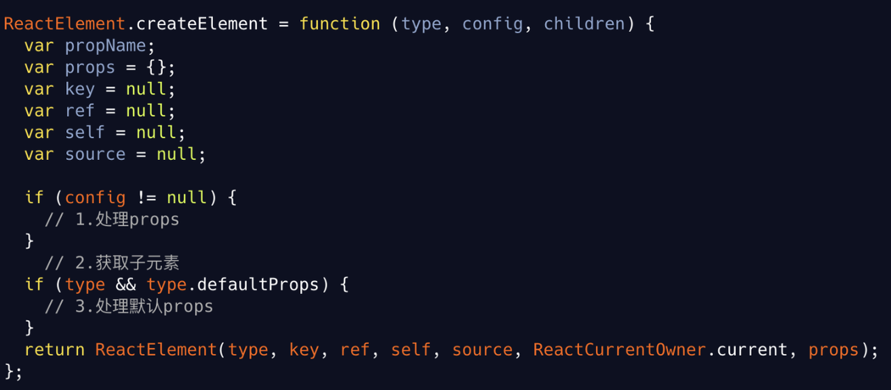
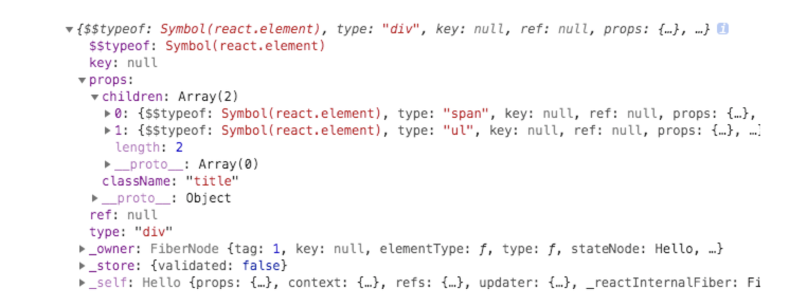
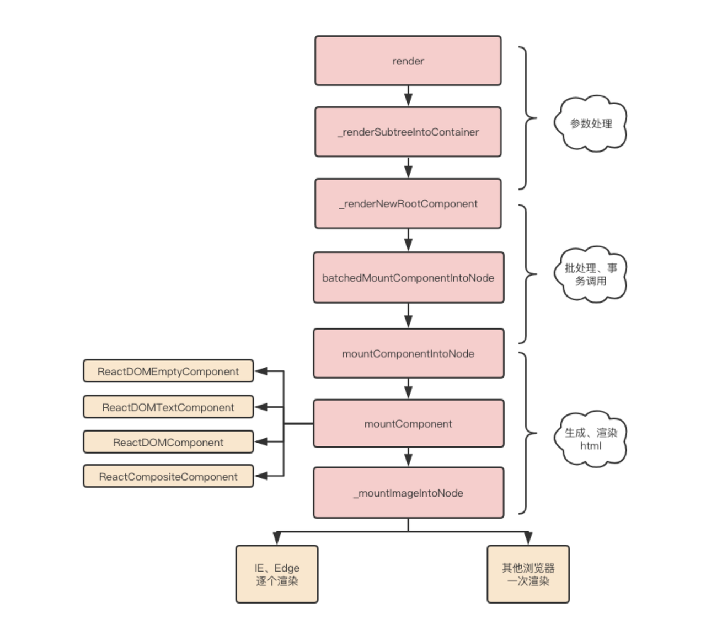
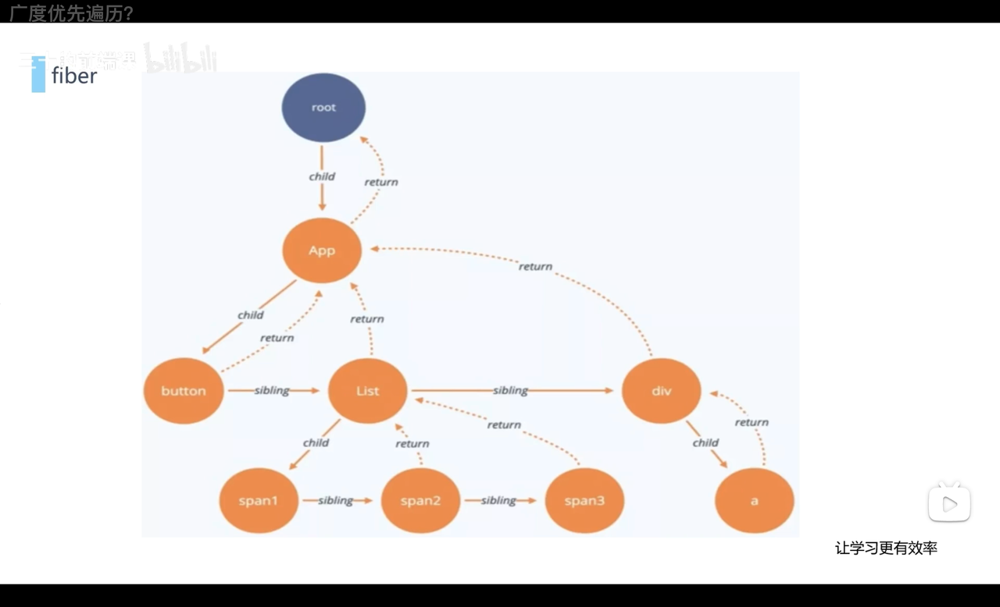
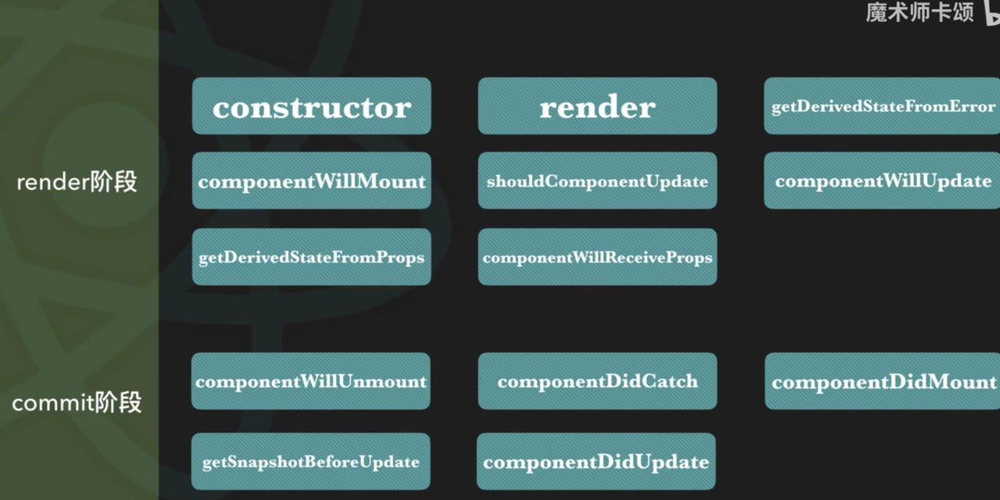
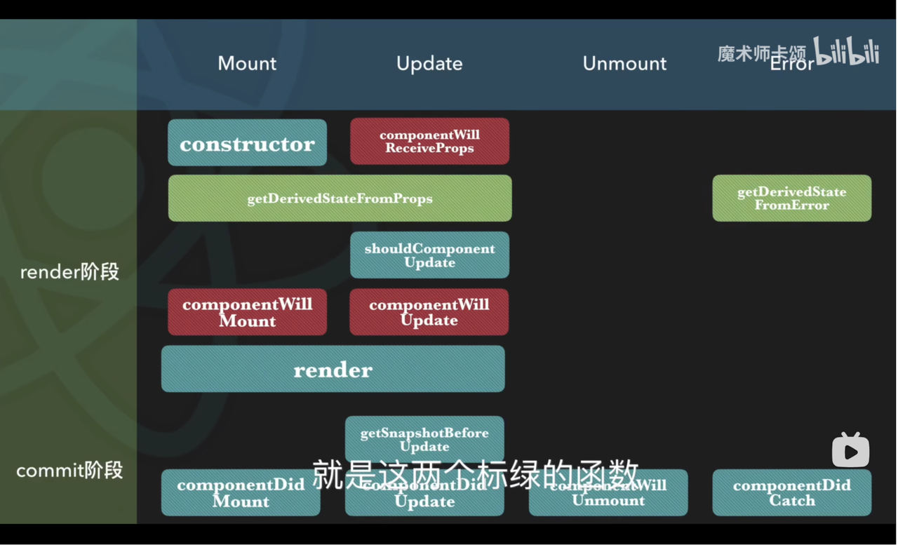
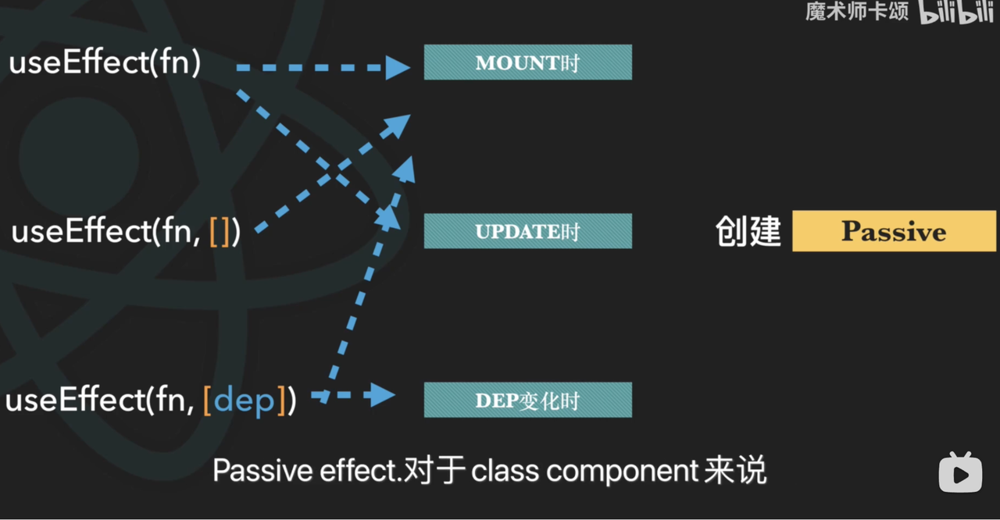
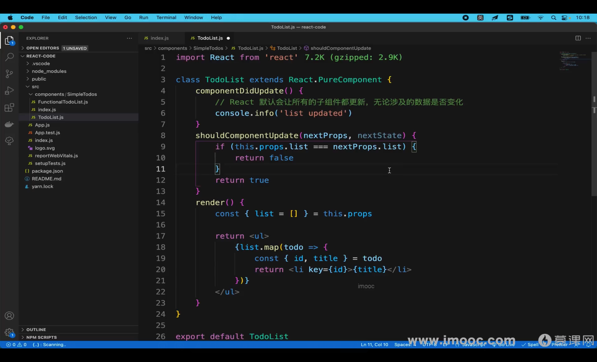
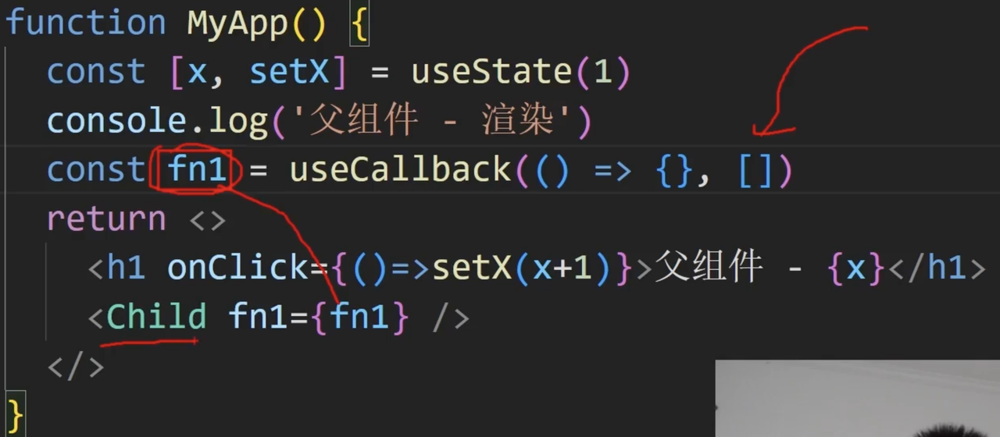
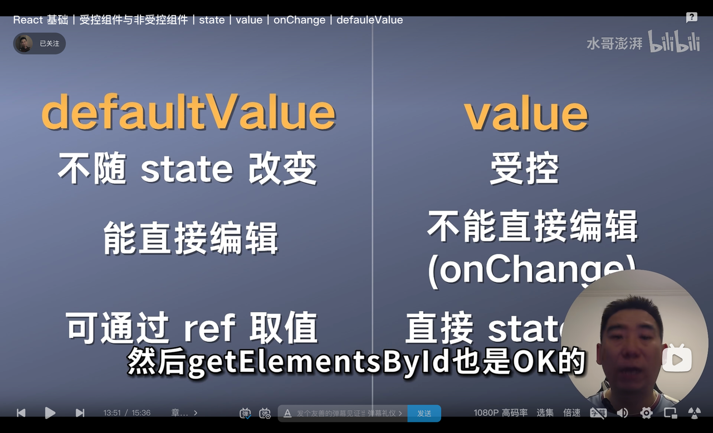

# React

最后修改时间: 2025-05-11

### 父组件渲染子组件

1. 父组件：componentWillMount

1. 父组件：render

1. 子组件：componentWillMount

1. 子组件：render

1. 子组件：componentDidMount

1. 父组件：componentDidMount

类似洋葱模型的一个顺序

### React15 同步模式

批处理

Reconciler 协调器 —— 递归方式。调用 render 函数生成虚拟 DOM 进行 Diff，找出变化后的虚拟 DOM

Renderer 渲染器 —— 将变化的组件进行渲染

生命周期和合成事件中，调用 setState 会将数据存入\_pendingStateQueue

递归更新子组件，更新流程一旦开始中途无法中断

### React16 异步模式

巨变 引入 Concurrent Mode、Fiber 、Time Slice

从递归变成了可中断的循环过程

- Scheduler（调度器）—— 调度任务的优先级，高优任务优先进入 Reconciler,使用时间切片的方式将复杂任务分片

- Reconciler（协调器）—— current fiber 和 React Element 进行 Diff 生成 workInprocess fiber，负责找出变化的组件

- Renderer（渲染器）—— 负责将变化的组件渲染到页面上

ReactElement 生成了对应的 Fiber 节点，Fiber 多了本次更新组件改变的状态、要执行的工作、需要被删除\插入\更新

render 阶段的任务可以被打断，一旦打断，之后会重新执行该任务

commit 阶段一旦执行一直会执行到任务结束

对于复杂任务，使用 Fiber 架构的时间切片原理，可以减少页面卡顿，毕竟 render 阶段可以打断，时间切片过程可以介入

### React17 并发模式

稳定 Concurrent Mode

使多个更新的工作流程可以并发执行

- useEffect 的优化

react17 之前，useEffect 中的清理机制是在 commit 阶段中完成；在 React17 中，useEffect 的清理机制是在 commit 阶段后完成，达成异步机制。这会提高 commit 效率

### React18 更灵活的 Concurrent Mode

legacy 模式：React.render 创建的应用，一次 render 对应一次 commit

concurrent:React.createRoot 创建的应用默认开启并发模式

blocking：React.createBlockingRoot 上面两种模式的过渡

### JSX

- JS 文件中写 Html

- 使用 JSX 语法，等价于使用 React.createElement()，babel 帮助完成转化过程，最终得到 ReactElement（即虚拟 DOM）

- ReactDom.render 将生成好的 ReactElement 渲染到指定容器里，最终转换为真实 DOM

```JavaScript
function Hello(){
  return React.createElement("div",[],"hello,world")
}
function Hello(){
  return <div>Hello,world</div>
}
```

### 事件绑定

1. 传参 通过 bind 传

1. 获取事件对象 不传参，默认第一个参数 e；传参，默认最后一个参数

### 响应式数据

对于对象和数组，只有地址改变才能判定为真正发生改变

### setState 异步

- 在 react18 之前，

  - 进入到 react 生命周期和合成事件就是异步；没有进入就是同步
  - didmount 之后，从\_pendingStateQueue 取出状态，从 dirtyComponent 取出要更新的组件，达到异步效果
  - 异步代码和原生事件中，比如 setTimeout\setInterval 不会进入到 React 整个流程中，可以达到同步效果。但是这种同步情况会造成性能浪费

- react18 之后
  - 默认都是异步
  - flushSync 则可以全部同步，但是非常消耗性能，慎用
  - 实际上，如果要使用到最新的值，对于类组件来说，可以在 componentDidMount 或者 componentDidUpdate 中拿到最新的值；对于函数组件来说，可以在 useEffect 的回调函数中拿到最新的值

### React 类型验证

propsType 需要自己手动定义验证

可以直接使用第三方 propsType 库进行类型验证

```JavaScript
class Son extends React.PureComponent{

}
// 类型检查
Son.propsType = {
  mes : function(props){
    if(typeof props.mes !== "string"){
      throw new Error("mes must be a string")
    }
  }
}
// 默认值
Son.defaultProps = {
  mes : "default value"
}
```

### 函数组件和类组件

- 函数组件没有 this

- 函数组件没有生命周期

- 函数组件得使用各种 hooks 完成各种操作

- 函数式组件开销更小，用时创建用完就扔；想要缓存数据就得使用 useMemo 或者 useCallback；类组件开销很大，大量数据常驻内存

### 类组件缺点

- 状态复用很难

- 代码难理解

- this 指向麻烦

### 源码 虚拟 DOM

```JavaScript
<div class="title">
      <span>Hello ConardLi</span>
      <ul>
        <li>苹果</li>
        <li>橘子</li>
      </ul>
</div>
{
  type:"",
  children:
}
const VitrualDom = {
  type: 'div',
  props: { class: 'title' },
  children: [
    {
      type: 'span',
      children: 'Hello ConardLi'
    },
    {
      type: 'ul',
      children: [
        { type: 'li', children: '苹果' },
        { type: 'li', children: '橘子' }
      ]
    }
  ]
}
```

### 源码 为何使用虚拟 DOM

- 提升开发效率

对于 DOM 操作、事件处理，React 会自动处理

- 提升性能

mount 并没有任何优势，甚至额外多了一步计算虚拟 DOM 的过程；

update 才体现出虚拟 DOM 的优势，结合 diff 算法和批处理策略达到高效更新

- 跨平台兼容

根据虚拟 DOM，画出相应平台的 UI 层

### 源码 JSX 转 ReactElement

 <!-- 图片未成功捕获 -->

 <!-- 图片未成功捕获 -->

```JavaScript
ReactElement.isValidElement = function (object) {
  return typeof object === 'object' && object !== null && object.?typeof === REACT_ELEMENT_TYPE;
};
```

key 组件唯一标识

ref 访问原生 DOM 节点

owner 当前 component 所属 component

?typeof 配合 isValidElement 会把不能渲染的 ReactElement 给过滤掉

self:当前位于哪个组件实例（开发环境有效）

\_source：调试代码来自的文件&行数（开发环境有效）

### 源码 ReactElement 转 DOM

 <!-- 图片未成功捕获 -->

### Fiber

 <!-- 图片未成功捕获 -->

- Fiber 使用了时间切片的思想，为了能够在渲染后继续进行，每个 hooks 节点会有指针分别指 child\Father\Sibling 节点；

- 每一次任务执行的耗时大约为 16ms 内=60hz，在这 16.6ms 内，既需要 JS 的执行，也需要完成样式的重排和重绘

### useState 渲染和 Fiber 树

当组件重新渲染时，React 会创建一个新的 Fiber 树，然后通过 diff 算法比较新旧 fiber 树的差异，并根据差异来更新 DOM。每一个 useState 生成的 hook 对象是 Fiber 树中的一个节点

### Hoc 高阶组件

本质是一个方法。入参是组件，出参是一个更高级的组件

```JavaScript
// 可以给每个组件添加属性和函数
import React from 'react'
function HocTest(UseComponent){
  state:{
    x:0,
    y:0
  }
  componentDidMount(){
    window.addEventListener("mouseover",(e)=>{
      let x = e.clientX
      let y = e.clientY
      this.setState({
        x:x,
        y:y
      })
    })
  }

  return class extends React.Component{
    return <div>
      <UseComponent x={this.state.x} y={this.state.y} {...this.props}/>
    </div>
}
```

### React 生命周期

 <!-- 图片未成功捕获 -->

React 生命周期函数中，一些函数会在 render 阶段调用；一些函数会在 commit 阶段调用

render 阶段：在内存中构建虚拟 dom 的阶段，做 diff 算法比对过程，该阶段可以被打断（15 版本之前不能被打断）

commit 阶段：其实是浏览器实际渲染过程。一旦开始就不能中断

两个阶段的零界点就是 render 函数

 <!-- 图片未成功捕获 -->

React 原理卡颂解释

概括：react 生命周期分为两大阶段，计算状态变化的 render 和实际渲染的 commit。

无论是 Mount 还是 Update，都会有这两大阶段，只是这两大阶段执行的生命周期钩子函数不同。对于 Mount 也就是首屏渲染，会执行 constructer、componentWillMount、render、componentDidMount；对于局部更新，执行的是 componentWillUpdate、render、componentDidUpdate

受屏加载采用深度优先遍历，逐个结点执行生命周期流程；事件局部更新采用从叶子结点反深度优先遍历，逐个节点执行生命周期流程

 <!-- 图片未成功捕获 -->

这张图也符合直觉，如果是 useEffect(fn)写法，mount 和 update 时都会执行；如果是 useEffect(fn,[])只在 mount 时执行；如果是 useEffect(fn,[dep])则在 dep 变化和首屏执行

### useEffect(fn,[])和 componentDidMount

useEffect(fn,[])会在 commit 阶段执行完之后，异步调用回调函数 fn；componentDidMount 会在 commit 中的 layout 阶段同步调用

和 componentDidMount 完全一样的钩子是 useLayoutEffect

### React key

列表渲染的时候，通常需要一个 key 属性来作为唯一标识

原理：高效率识别 DOM&更新 DOM 并渲染。Diff 过程中，快速定位变化

避免使用索引作为 key。原因：React 会根据数组位置来识别 DOM，如果列表发生动态变化，列表会全部重新渲染，但是原列表的每一项存储的值没有跟随变化

### React 性能优化

主要还是由于新旧 dom 节点 diff 算法的比对，带来了大量的计算。React 底层使用了时间切片的方式提升效率，不会长时间白屏

- 父组件带动子组件更新；

  - 使用 React.memo(函数组件)\PureComponent(类组件)；类组件使用 shouldComponentUpdate
  - 避免 state 同样的值产生更新：函数组件可以自己判断；类组件需要继承 PureComponent
  - 子组件接收到的只是普通引用对象(state 数据没有这个问题)，由于创建对象会引起地址改变，子组件也会更新。这里的解决方法：使用 useCallback 包方法，使用 useMemo 包数据。

- 使用空标签

- 函数不要定义在 JSX 中,JSX 中的代码频繁更新，如果写在里面，每次执行都会有新建函数的开销

- 构造函数中 bind(this)

- 异步组件

- 路由懒加载 React.lazy

```JavaScript
import {lazy,suspense} from 'react'
const Home = lazy(import('./Home'))
<Router>
  <Switch>
    <Rout component={Home}></Rout>
    <Rout component={List}></Rout>
  </Switch>
</Router/>
```

 <!-- 图片未成功捕获 -->

### useReducer

和 useState 类似，也是定义组件内部的状态；但是功能复杂的时候，比如对同一个状态做加减乘除多种操作的时候，可以选用 useReducer，将其封装在一起

```JavaScript
import {useReducer} from 'react'
// 自定义一个reducer函数
const reducer = （state,action） => {
  switch:
    cace "+":
      return state + action.payload
    case "-":
      return state - action.payload
}
const [state,dispath] = useReducer(reducer,100)
// 使用dispath改变state值
{state}
<Button onClick = {dispath({type:"+",payload:1})}>+<Button/>
```

### useRef

经常与真实 dom 关联在一起，要在 componentDidMount 阶段后获取

### useContext

- 现在国内大厂普遍使 useContext 代替 redux 使用

- 只是在接收阶段简化了 context 的使用，创建阶段依然需要使用 createContext

```JavaScript
import {useContext,createContext} from 'react'
const CustomContext = createContext(null)
// 父组件
const Parent = () => {
  const [username,setUsername] = useState("初始化")
  return
    <CustomContext.provider value = {username,setUsername}>
      <Child/>
    <CustomContext.provider/>
}
// 子组件
const Child = () => {
  return <GrandChild/>
}
// 孙组件
const GrandChild = () => {
  const {setUsername} = useContext(CustomContext)
  return <Button onclick = {setUsername}/>
}
```

### useCallback

作用缓存函数 ，减少不相关组件的重新渲染

```JavaScript
const Child = () => {
  return <h2><h2/>
}
const Parent = () => {
  const [x,setX] = useState()
  // const fn = () => {}
  const fn = useCallback(() => {},[]) // 若没有useCallback，Child组件每次都会触发更新，带来不必要的渲染
  return
    <>
      <h1 onClick={setX(x+1)}>父组件:{x}</h1>
      <Child fn={fn}/>
    </>
}
```

 <!-- 图片未成功捕获 -->

### useMemo

也是做缓存，useCallback 存储的是函数，而 useMemo 函数计算结果的缓存。若没有使用 useMemo，MyMemo 组件每次都会全部执行；若使用了 useMemo，则只有在 arr 发生变化的时候求和操作才会执行一次

```JavaScript
function MyMemo(){
  const [arr,setArr] = useState([1,2,3])
  const all = useMemo(()=>{
    let _all = 0
    arr.forEach((item) => {
      _all += item
    })
    return _all
  },[arr])
  return
}
```

### 受控组件和非受控组件

受控与否是通过 state 来判断

```JavaScript
const [num,setNum] = setState(100)
受控   <Input value={num} onChange={(e)=>{setNum(e.target.value)}}/>
非受控 <Input defaultValue = {num} />
<Button onclick={setNum(num+1)}/>
```

 <!-- 图片未成功捕获 -->

### Lighthouse 和 Devtools

### 性能测量：Profiler 组件

可以打印出 React 组件的性能指标

```JavaScript
import React, { Fragment, unstable_Profiler as Profiler} from "react";
const callback = (id, phase, actualTime, baseTime, startTime, commitTime) => {
    console.log(
${id}'s ${phase} phase:
);
    console.log(
Actual time: ${actualTime}
);
    console.log(
Base time: ${baseTime}
);
    console.log(
Start time: ${startTime}
);
    console.log(
Commit time: ${commitTime}
);
}
render(
  <App>
    <Profiler id="Header" onRender={callback}>
      <Header {...props} />
    </Profiler>
    <Profiler id="Movies" onRender={callback}>
      <Movies {...props} />
    </Profiler>
  </App>
);
```

Profiler 的 onRender 回调接收描述渲染内容和所花费时间的参数:

- id: 生提交的 Profiler 树的 id。如果有多个 profiler，它能用来分辨树的哪一部分发生了“提交”。

- phase: "mount" (首次挂载) 或 "update" (重新渲染)，判断是组件树的第一次装载引起的重渲染，还是由 props、state 或是 hooks 改变引起的重渲染。

- actualDuration: 次更新在渲染 Profiler 和它的子代上花费的时间。

- baseDuration: 在 Profiler 树中最近一次每一个组件 render 的持续时间。这个值估计了最差的渲染时间。

- startTime: 本次更新中 React 开始渲染的时间戳。

- commitTime: 本次更新中 React commit 阶段结束的时间戳。在一次 commit 中这个值在所有的 profiler 之间是共享的，可以将它们按需分组。

- interactions: 当更新被制定时，“interactions” 的集合会被追踪。

### 性能测量 trace Api

```JavaScript
import { unstable_Profiler as Profiler } from "react";
import { render } from "react-dom";
import { unstable_trace as trace } from "scheduler/tracing";
class MyComponent extends Component {
  addMovieButtonClick = event => {
    trace("Add To Movies Queue click", performance.now(), () => {
      this.setState({ itemAddedToQueue: true });
    });
  };
}
```

### 性能测量 Puppeteer

```JavaScript
const puppeteer = require('puppeteer');
(async () => {
  const browser = await puppeteer.launch();
  const page = await browser.newPage();
  const navigationPromise = page.waitForNavigation();
  await page.goto('https://react-movies-queue.glitch.me/')
  await page.setViewport({ width: 1276, height: 689 });
  await navigationPromise;
  const addMovieToQueueBtn = 'li:nth-child(3) > .card > .card__info > div > .button';
  await page.waitForSelector(addMovieToQueueBtn);
  // Begin profiling...
  await page.tracing.start({ path: 'profile.json' });
  // Click the button
  await page.click(addMovieToQueueBtn);
  // Stop profliling
  await page.tracing.stop();
  await
```
